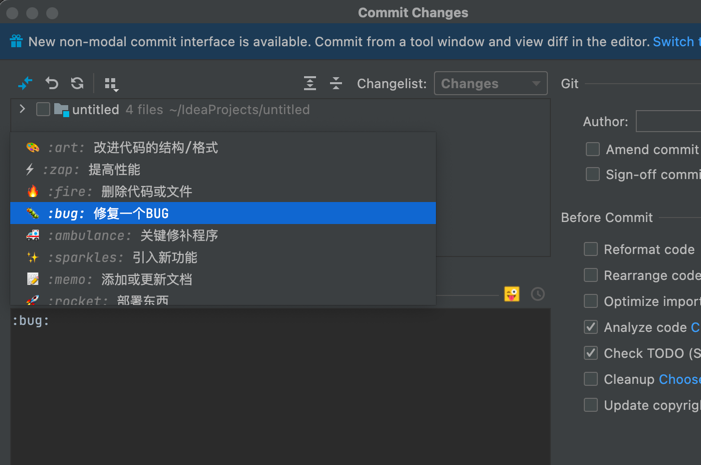
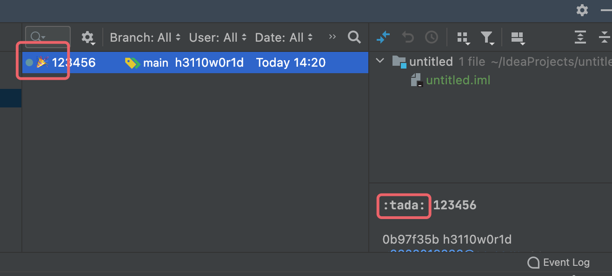

# Gitmoji Plus

gitmoji-plus-intellij-plugin

## 本项目由以下两个项目合并
- [Emoji Commit Log Viewer (MIT License)](https://github.com/siosio/EmojiCommitLogViewer)
- [Gitmoji Plus: Commit Button (Apache License 2.0)](https://github.com/patou/gitmoji-intellij-plugin)

所以本项目采用Apache License 2.0许可

## 特性
- 汉化了Commit提示(机翻)
- 优化了Emoji Commit Log Viewer的Patch方案，屏蔽了报错

## 功能

